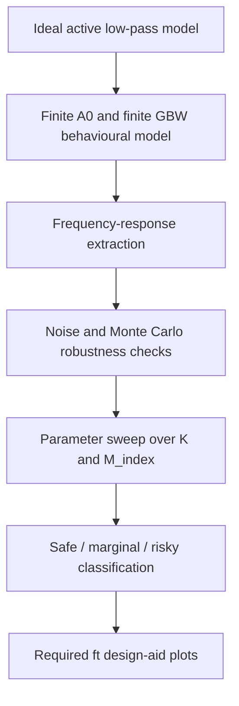
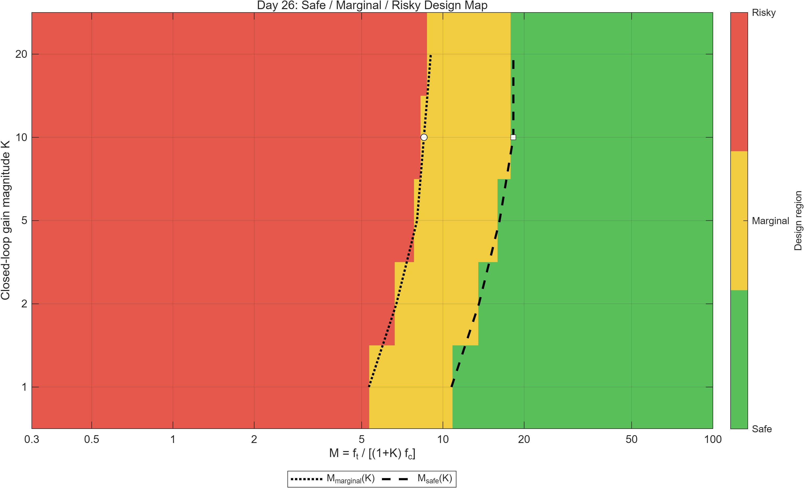
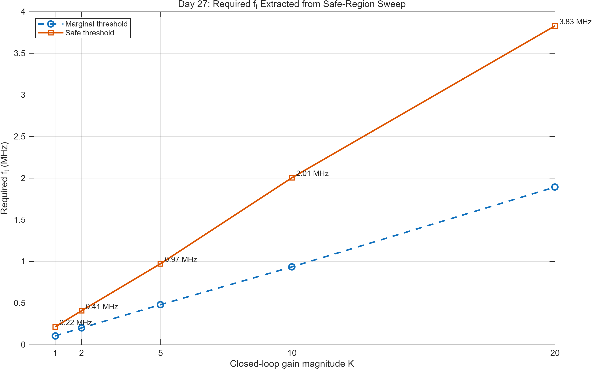
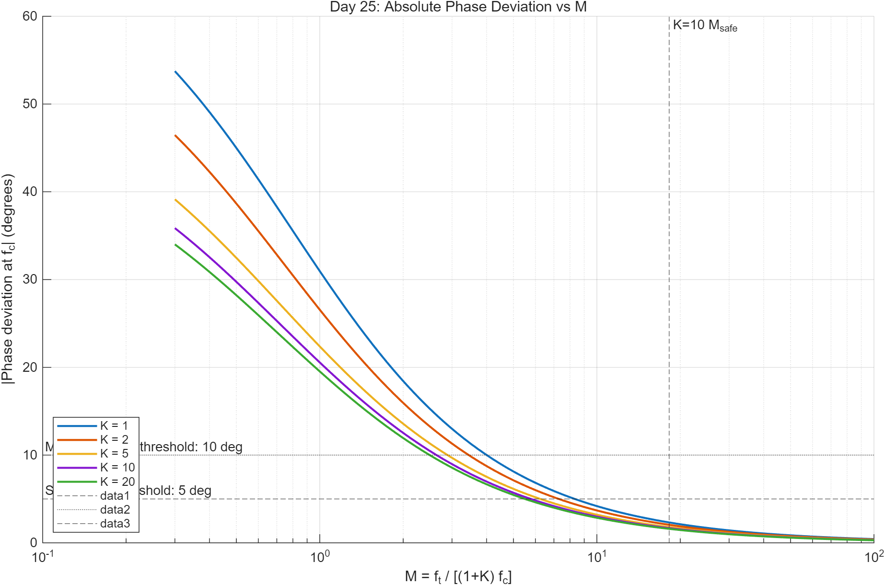

# Op-Amp / TIA Design Region Mapping

## Project Overview

This repository is a MATLAB-only behavioural modelling project.

It studies finite gain-bandwidth product effects in a first-order inverting op-amp active low-pass filter.

The project uses frequency-domain modelling.

It also uses metric extraction, parameter sweeps, and design-region classification.

The goal is to build a safe / marginal / risky design-region map under the assumptions of the behavioural model.

The current model is focused on an active low-pass filter.

The workflow is intended to be extendable toward photodiode transimpedance amplifier modelling.

It is not yet a complete photodiode TIA project.

For a more detailed explanation of the modelling assumptions, metric extraction method, and design-region workflow, see [docs/technical_note.md](docs/technical_note.md).

## What This Project Demonstrates

- MATLAB-based behavioural modelling of op-amp finite-GBW effects
- frequency-response extraction and validation
- gain error, cutoff-frequency error and phase-deviation analysis
- parameter sweep over closed-loop gain and GBW margin index
- safe / marginal / risky design-region classification
- generation of model-based design-aid plots
- a documented workflow that can later be extended toward photodiode TIA modelling

## Workflow Summary

This is an active low-pass filter modelling workflow with a planned extension path toward TIA modelling.



## Engineering Motivation

In practical op-amp circuit design, finite DC open-loop gain can affect closed-loop accuracy.

Finite unity-gain frequency can also affect bandwidth and phase response.

These non-idealities can produce closed-loop gain error.

They can also produce cutoff frequency shift.

They can introduce additional phase lag.

This project builds a behavioural model that relates a gain-bandwidth margin index to those errors.

The aim is to make finite op-amp gain-bandwidth effects visible across different feedback gains and cutoff-frequency targets.

The extracted metrics are then used to classify design regions.

## Model Summary

The core response model is implemented in `functions/active_lpf_response.m`.

Key parameters:

- `Rin` = input resistance
- `Rf` = feedback resistance
- `Cf` = feedback capacitance
- `K = Rf / Rin`
- `fc = 1 / (2*pi*Rf*Cf)`
- `A0` = DC open-loop gain
- `ft_Hz` = unity-gain frequency / GBW-equivalent frequency
- `M_index = ft_Hz / ((1 + K) * fc)`

`M_index` is used here as a GBW margin index.

It is not a formal stability margin.

It is not a phase margin.

It is not a loop-stability guarantee.

The project uses an inversion-removed response for metric extraction.

The response is written as:

```text
G = -H
```

This makes magnitude and phase comparisons easier to interpret for the inverting filter response.

## Repository Structure

The current repository structure is:

- `functions/` : reusable MATLAB functions
- `scripts/` : step-by-step experiment scripts
- `figures/` : exported figures
- `scripts/figures/` : early-stage script-generated figures
- `scripts/results/` : CSV, MAT and Markdown result summaries
- `docs/` : supporting technical documentation

This README describes the current structure as-is.

## Main Functions

- `active_lpf_response.m` : computes the ideal and finite-op-amp behavioural frequency responses for the active low-pass filter model.
- `extract_frequency_metrics.m` : extracts gain, cutoff-frequency, and phase-related metrics from frequency-response data.
- `compare_frequency_responses.m` : compares frequency responses and returns error metrics.
- `add_measurement_noise.m` : adds synthetic measurement noise for robustness checks.
- `classify_design_region.m` : classifies designs into safe, marginal, and risky regions using extracted metric thresholds.
- `find_margin_thresholds.m` : derives margin thresholds from classified sweep results.

## Requirements

- MATLAB
- Standard MATLAB plotting support
- Standard MATLAB table I/O support
- No Python is required for the current MATLAB workflow
- No SPICE simulator is required for the current workflow
- No external measurement hardware is required for the current workflow

The scripts are intended to be run from the repository root or from the `scripts/` directory.

The recommended workflow is listed below.

## Suggested Quick-Start

For a quick project-level regeneration of the main sweep, classification, and final design plots, run:

```matlab
cd scripts
run_12_day22_parameter_sweep_metrics
run_13_day23_classify_design_regions
run_14_day24_find_margin_thresholds
run_15_day25_error_vs_M_plots
run_16_day26_safe_marginal_risky_design_map
run_17_day27_required_ft_plot
```

This quick-start assumes the staged dependency chain is followed.

`run_13` uses outputs from `run_12`.

`run_14` uses outputs from `run_13`.

`run_17` uses outputs from `run_14`.

## Running the Project

Run scripts from the `scripts/` directory in the staged order below.

Recommended usage is to start MATLAB from the repository root.

Then run:

```matlab
cd scripts
```

No manual `addpath` is required for the main workflow.

The scripts resolve project paths internally.

### Stage 1: Basic model verification

- `run_01_ideal_model_verification.m`
- `run_02_nonideal_model_check.m`

### Stage 2: Finite-GBW and finite-A0 behaviour checks

- `run_03_day9_M_sweep_nonideal_response.m`
- `run_04_day10_high_ft_limit_check.m`
- `run_05_day11_ideal_limit_consistency_check.m`
- `run_06_day12_A0_DC_gain_sensitivity_table.m`

### Stage 3: Metric extraction and noise robustness

- `run_07_day15_clean_ideal_extraction_verification.m`
- `run_08_day16_clean_nonideal_extraction_test.m`
- `run_09_day17_virtual_measurement_noise_check.m`
- `run_10_day18_noisy_extraction_smoothing_test.m`
- `run_11_day19_monte_carlo_noise_test.m`

### Stage 4: Parameter sweep and design-region classification

- `run_12_day22_parameter_sweep_metrics.m`
- `run_13_day23_classify_design_regions.m`
- `run_14_day24_find_margin_thresholds.m`

### Stage 5: Final design plots

- `run_15_day25_error_vs_M_plots.m`
- `run_16_day26_safe_marginal_risky_design_map.m`
- `run_17_day27_required_ft_plot.m`

Dependencies:

- `run_13` depends on outputs from `run_12`
- `run_14` depends on outputs from `run_13`
- `run_15` depends on outputs from `run_12` and `run_14`
- `run_16` depends on outputs from `run_13` and `run_14`
- `run_17` depends on outputs from `run_14`

Stage 4 and Stage 5 scripts can also be read as this concise workflow:

| Script                                          | Purpose                                  | Main dependency                               |
| ----------------------------------------------- | ---------------------------------------- | --------------------------------------------- |
| `run_12_day22_parameter_sweep_metrics.m`        | Parameter sweep over K and M_index       | Core response and metric extraction functions |
| `run_13_day23_classify_design_regions.m`        | Classify safe / marginal / risky regions | Outputs from run_12                           |
| `run_14_day24_find_margin_thresholds.m`         | Extract margin thresholds by K           | Outputs from run_13                           |
| `run_15_day25_error_vs_M_plots.m`               | Plot error metrics versus M_index        | Outputs from run_12 and run_14                |
| `run_16_day26_safe_marginal_risky_design_map.m` | Generate design-region map               | Outputs from run_13 and run_14                |
| `run_17_day27_required_ft_plot.m`               | Generate required ft versus K plots      | Outputs from run_14                           |

Example MATLAB workflow:

```matlab
cd scripts
run_12_day22_parameter_sweep_metrics
run_13_day23_classify_design_regions
run_14_day24_find_margin_thresholds
run_15_day25_error_vs_M_plots
run_16_day26_safe_marginal_risky_design_map
run_17_day27_required_ft_plot
```

## Key Outputs

Main outputs include:

- gain error vs M
- cutoff frequency error vs M
- phase deviation vs M
- Monte Carlo noisy extraction results
- safe / marginal / risky design map
- required ft vs K plot

These outputs are exported as figures and result summaries.

The main output locations are:

- `figures/`
- `scripts/figures/`
- `scripts/results/`

## Representative Results

### Safe / Marginal / Risky Design Map



This figure summarises the design-region classification obtained from the parameter sweep.

Each region is classified using gain error, cutoff-frequency error, and phase-deviation thresholds.

The map is intended as a behavioural design aid under the assumptions of this model.

### Required ft versus Closed-Loop Gain



This figure converts the extracted GBW margin thresholds into required unity-gain frequency values for different closed-loop gain settings.

It should be interpreted as a model-based design guide.

It should not be interpreted as a universal op-amp selection rule.

### Error Trend versus GBW Margin Index



This figure shows how the extracted phase-deviation metric decreases as the GBW margin index increases.

It supports the use of M_index as a practical behavioural margin indicator in this project.

## Current Limitations

- This is a MATLAB behavioural model, not a SPICE simulation.
- No hardware measurement is included.
- No formal loop-stability analysis is included.
- `M_index` is a GBW margin index, not a phase margin or stability margin.
- The required ft plot is a design aid under this model, not a universal op-amp selection rule.

## Future Work

Possible next steps:

- improve repository structure;
- add more detailed documentation;
- add datasheet-based op-amp case studies;
- extend the model toward photodiode TIA design;
- compare behavioural results with SPICE simulation in the future.
